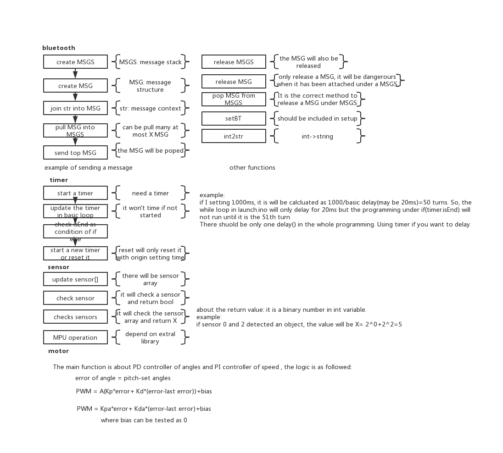

### Log Report
------
__This is log of programming of ACS6502 Project__
__Any changing of the codes should be logged here in formal style__
__Enjoy codes!!__

----
#### File structure
```
- launch.ino
- bluetooth.h
- bluetooth.c
- motor.c
- motor.h
- sensor.c
- sensor.h
- timer.c
- timer.h
``` 
---


----
#### Notes
__actually a chatting board__
1.Rule of version number(__A.XY+LTS__)
+ A is the structure version of codes
+ X can be 0 or 1, 0 means has not been tested, 1 means has been tested
+ Y is the updating version
+ LTS represents that it is the final version
+ e.g. 2.04 means the structure of codes has been changed for one version, it is the forth update of this structure. It has not been tested.


---
#### Update log
[11.26] Weng:
```c
+ version 1.03
+ bluetooth function has been tested roughly. 
  It can transfer through both of bluetooth and serial communication now
  an example to use it is as followed:
  //create a message stack, can hold 9 messages
  Msgs* msgs = create_msgs(9); 
  //create a message of "hello world". It can hold 50 characters.
  Msg* msg = create_msg("hello world",50); 
  //pull the message into message stack
  pull(msgs,msg);
  //send the message through serial port
  send(msgs);
  //release the message stack(in fact it may not happen)
  release_msgs(msgs);
+ the motor file has been updated. These are new methods
  typedef struct PIDOUT{
    float measured;
    float setted;
    float error;
    float last_error;
    }PidOut;
    void setmotor(int left,int right);
    int pid(PidOut* outs);
+ int2str function has been disabled since bugs
```

[11.25] Weng:
```C
+ file structure updated. The current version is 1.02
  new files:
    - motor.c && motor.h
    - sensor.c && sensor.h
    - timer.c. && timer.h
    (motor and sensor still in developing)
+ new library has been added to use MPU6050 module
  source: https://github.com/jrowberg/i2cdevlib/tree/master/Arduino
+ the detailed logic graph has been released
```
[11.19] Weng:
```c
+ API of bluetooth has been updated. The current version is 1.01
  new methods are:
    void setBt(); // initial bluetooth
    void printMsg(); // print initial msg
    void create_msgs(Msgs* msgs,int size); // create message stack
    void create_msg(Msg* msg,int size); // create a message
    void release_msgs(Msgs* msgs); // clear the whole stack
    void release_msg(Msg* msg); // delet the message
    void send(Msgs* msgs); // send a message on the top of stack
    int pull(Msgs* msgs, Msg* msg); // put in a message into stack
    int pop(Msgs* msgs, Msg* msg); // delet top message 
    Msg* join(Msg* msg, char* str); // add string into a message
    char* int2str(int num); // change int into string
+ bluetooth.h and bluetooth.c has been uploaded. 
```